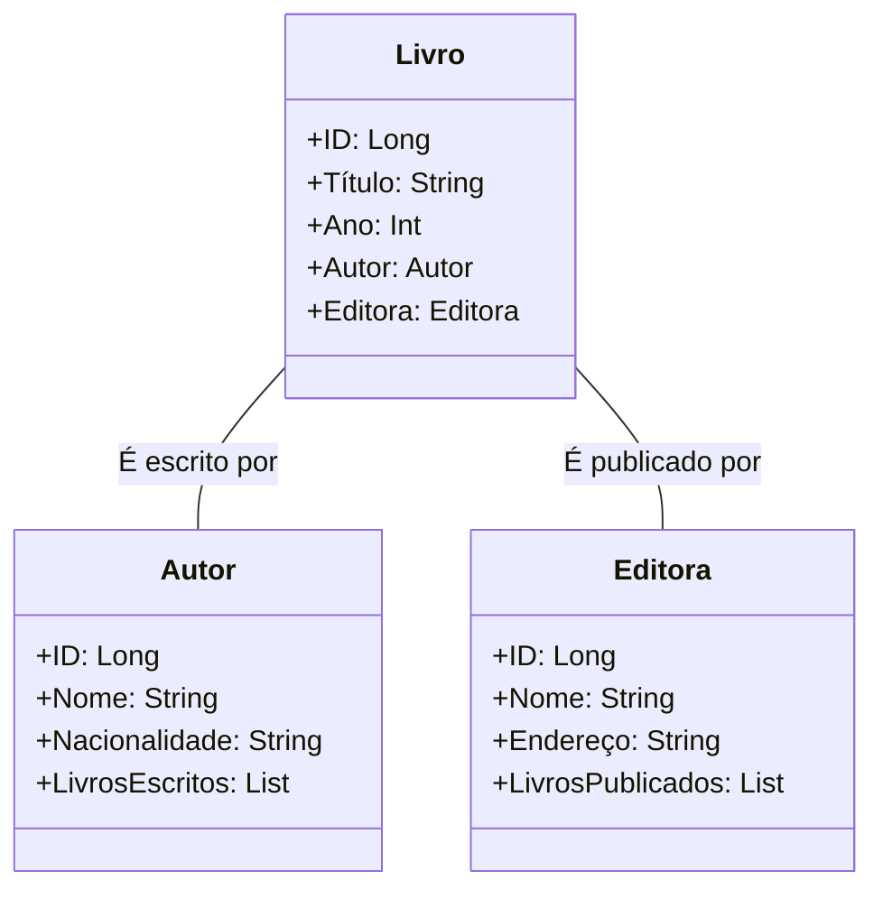

# API-Backend-Java-Santander-Bootcamp-2023
# Sistema de Gerenciamento de Biblioteca
Spring Boot Project Santander Bootcamp 2023 - Backend Java

### Introdução

Esta API é um sistema de gerenciamento de biblioteca simples, desenvolvido em Java Spring Boot, que permite aos usuários realizar operações relacionadas a livros, autores e editoras. Ela é projetada para acompanhar informações sobre livros, os autores que os escreveram e as editoras que os publicaram.

### Principais Entidades:

**Livro:** Representa um livro em uma biblioteca. Cada livro possui um título, um ano de publicação e está associado a um autor e uma editora. Os livros são a entidade principal deste sistema.

**Autor:** Representa o autor de um livro. Cada autor possui um nome e uma nacionalidade. Além disso, um autor pode estar associado a vários livros, o que permite rastrear todos os livros escritos por esse autor.

**Editora:** Representa a editora responsável pela publicação de um livro. Cada editora tem um nome e um endereço. Da mesma forma que os autores, as editoras podem ter vários livros publicados sob seu nome.

### Relacionamentos:

Cada livro está associado a um único autor, refletindo o autor que o escreveu. Isso é representado pelo relacionamento "É escrito por" entre a classe Livro e a classe Autor.

Cada livro também está associado a uma única editora, indicando quem publicou o livro. Isso é representado pelo relacionamento "É publicado por" entre a classe Livro e a classe Editora.

### Funcionalidades Esperadas:

Os principais recursos que podem ser implementados nesta API incluem:

CRUD de Livros: Permite criar, ler, atualizar e excluir informações sobre livros.

CRUD de Autores: Permite gerenciar informações sobre autores, incluindo a associação de livros a autores específicos.

CRUD de Editoras: Permite gerenciar informações sobre editoras, incluindo a associação de livros a editoras específicas.
